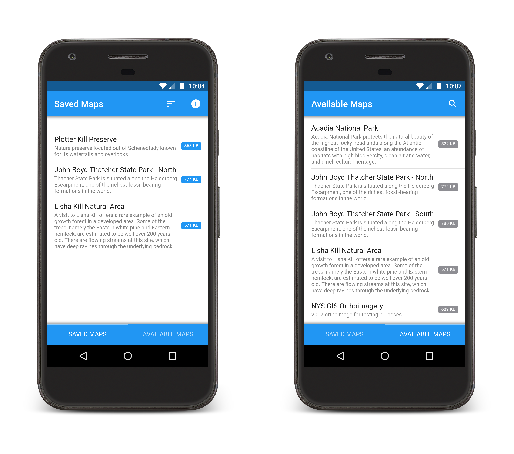

# Maps
A simple map viewer, built for the mobile web. Save your favorite georeferenced map images to your mobile device for offline viewing and navigation.

## Demo
https://bmcbride.github.io/maps/

## Features
* Mobile web app with offline capabilities via Application Cache (application files) & IndexedDB (saved maps).
* Native-like material design user interface via [Framework7](https://framework7.io/) with custom list ordering, search, and pull to refresh functionality to update available maps list.
* Cross-platform "mobile web app capable" with "add to home screen" functionality for immersive fullscreen experience.
* Leverages [OpenLayers](http://openlayers.org/) to display a single, static image for viewing simple, small georeferenced map images (parks, hiking trails, etc.).
* Optional online basemaps with static map overlay opacity control.
* Upload georeferenced map files and configure [maps.json](https://github.com/bmcbride/maps/blob/gh-pages/maps.json) file for customized Available Maps list.
* Save and remove maps from device storage as needed.

## Screenshots

